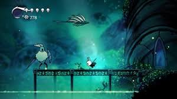

# Alex's Portfolio

# Identifying and Defining
## PMI
Plus: Improves hand-eye coordination and cognitive abilities while developing their motor skills, as well as reaction times and problem-solving skills.

Minus: Can bee too addicting for the user and they may want to play the game instead of doing other useful things.

Interesting: Making this game introduces a very old genre that has not been one of the popular genres for a while, so making this game will introduce a new gaming category to players.

| Existing Idea | Plus | Minus | Implication |
|:------------- |:---- |:----- |:----------- |
| Soul Knight |  |  | 
| Hollow Knight |  |  | 
| Dead Cells |  |  |  |

### Need
To improve young teen's hand-eye coordination and cognitive abilities while developing their motor skills, as well as offering a fun and entertaining way to improve essential developmental skills, such as reaction times, problem-solving skills.

### Problem Statement
Lots of teenagers struggle with conentrating due to their short attention spans, which is caused from short-form videos such as Tiktok, Youtube Shorts and WeChat Channels. By making a very interesting game, users will want to interact with the challenges within the game, resulting in a repaired attention span, allowing them to focus in other aspects of life, like school.

### Skill Development
To develop the skills in Unity required to create the game, I would complete the 2D Rougelike tutorial, which can teach me the basics of the game, allowing me to expand further and exploring better game features.

## Requirements Outline
### Inputs
- Movement Keys: WASD, Arrows
There will be an "8 directional" player movement system which allows people to move whevever they want (up, down, left, right, diagonals).
- Ability Keys: Designated keys for an ability (magic, puches, e.g.)
- GUI Keys: Buttons to open inventory, interact, and more.

### Processing
The game will detect the user for when an enemy is defeated, which will then update the score accordingly, also with when the user loses a life, they will also lose some of their score.

### Outputs
The player's avatar with their location and health will be displayed, along with their equipped tools (like weapons and utilities). When the user kills an enemy, there will be a death sound as well as when the user dies.

### Transmission
There will not be any online transmissions as the 2D Rougelike game is going to be singleplayer.

### Storage
The game will have all of the assets in different categorized folders (e.g. sprites, scripts, and prefabs), just like in the 2D platformer game that everyone did last term. The whole game will be tried to be optimized, ensuring that users with low or slow storage can run it without it being hard.

## Functional Requirements
### User Interaction
The user will interact with the game using the keyboard and mouse inputs. They can move their character, select their weapon, etc. They can press E for their inventory, F and C to use their abilities, T to dodge and more.

### Core Gameplay or Simulation Mechanics
The main objective of the game is to rescue his best friend trapped in a cage, while he has to go through deeper dungeons, fighting off monsters and enemies. The user will need to dodge, with good movement and combat skills, to reach the key and to unlock the next level.

### Scoring and Feedback (if applicable)
Every time the user defeats a monster and unlocks the next level, they get a specific amount of points. They get even more when they rescue the main character's best friend, and they beat the game when they leave the dungeon.

### Level Progression or Simulation Stages (if applicable)
There will be multiple levels of the dungeon, allowing players to have a good amount of gameplay, defeating monsters and enemies until you save the main character's best friend.

### Saving and Loading Data
The game will store all of the game data locally on the computer, so that it is able to be played offline whenever the user pleases. There will be an auto-saving feature everytime the player enters a new level so that they do not lose any progress.

## Non-Functional Requirements Instructions
### Performance Requirements
In the future, the game will need some optimization (just like the storage mentioned above) to make the game able to run for slow computers. This can be done by only rendering the level once at a time, so when the player joins a new level, it will then load instead of loading all levels at once.

### Security Requirements
Once the game is more advanced,you can access your settings and game info thru a login screen, which then decrypts the sensitive data and allows the player to access their own personal game files.

### Reliability and Availability
Since the game is locally played, it should be available basically 100% of the time, and with crash reports sent to the owner (me), allowing new bugs and features the be fixed. The game will then be update/fixed ASAP and released to whatever platform the game is on.

## Consideration of Social and Ethical Issues
### Define the following terms:
- Equity

Equity is the fairness of a judgement to things. Basically, equity gives based on whatever someone/something needs, which is different to evenly distributing things to people/things, which is called equality. For example, if 3 people needed to see over their fence (one tall, one medium and one short), 'equity' would give them different sized blocks which would each help them see over the fence at the same height, but equality would give them the same sized block, meaning not everyone can see over the fence.
- Accessibility

How easy something is to be reached. If something has low accessibility, then it would be hard to get. If it has high accessibility, then it would be easy to get. For example, the new RTX 5090, which is scheduled to release next year, would have low accessibility as there is a high demand with limited stock. Something with high accessibility would be water, as you can basically get it anywhere, such as from your taps and at a public water dispenser.

### Accessibility
My project will mostly be able to support intermediate and experienced gamers over 13, as there is a lot of mechanics that new players may need to learn and practice, which will take some time, but will get some help. To help these new players, there will be things such as a tutorial level, which gets them to know the game and to know the controls and everything, so that they can actually know how to play the game.

### Privacy and Data Protection
Because the game is very new and is not big, there will be no need to collect any of the user's personal information like where they live (it will only be considered in the future, if the game grows a lot), unlike some gaming big companies like Rockstar, etc. The game will need to collect the data like the score and game files, but it will be encrypted and stored securely once the game progresses more advanced.

### Fairness and Representation
The project will not be stereotypical or discriminatory, it will only include monsters and a main character, along with their best friend. The main character will be brown, rescuing his white friend, which is not stereotypical in any way. If the game does develop and become more popular, there may be some character customizatioin to further limit how 'discriminatory' the game is.

### Mental and Emotional Well-Being
It will be pretty hard for the game to affect the player's mental health, as it is not too hard to play, and there is a tutorial level to get them started. The monster's and the deaths are not too gorey or gruesome, so that everyone can enjoy and not get affected by the game in terms of its maturity. There will be an age rating of 13+, to make sure everyone is suitable for the game.

### Cultural Sensitivities
The content is not offensive to cultures, as it is just about someone killing monsters and rescuing their best friend. There will not be anything related to any relgions that offend it, including satanic symbols, mocking gods, etc. The game is supposed to be friendly (apart from the monsters) and playable, not offending cultures.

# Researching and Planning

